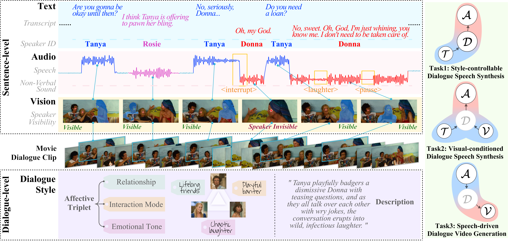
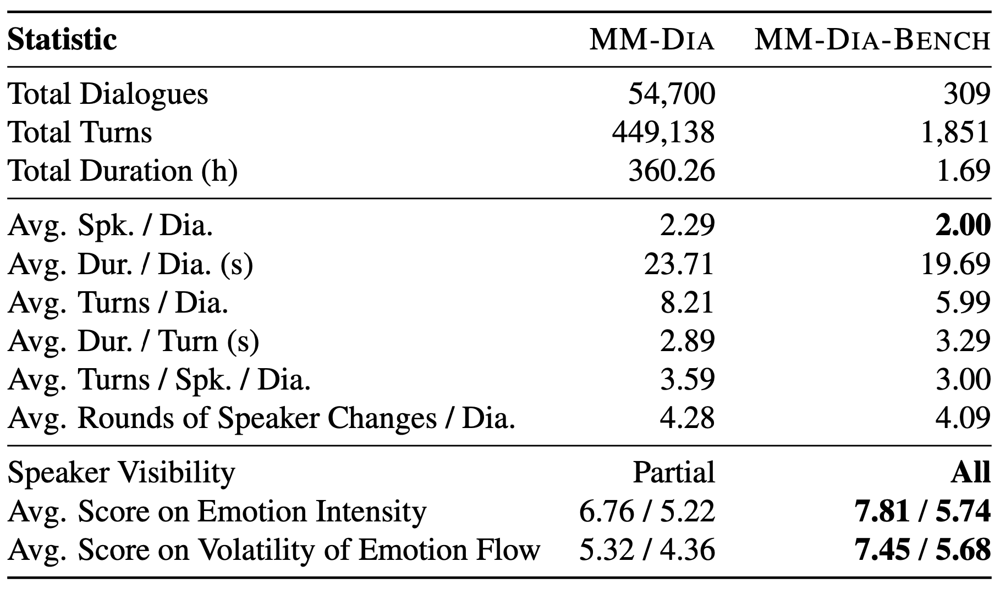
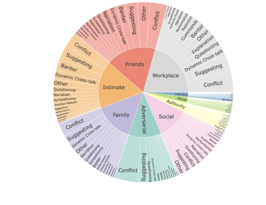
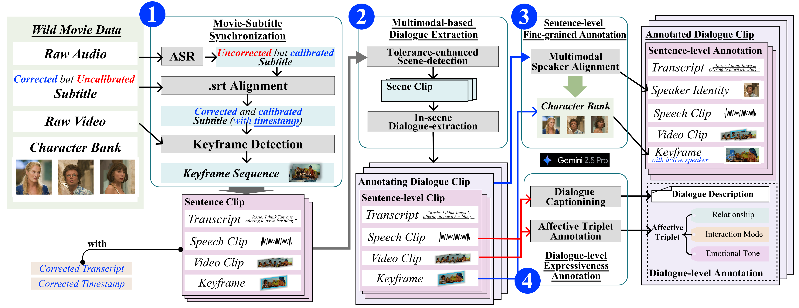

# MM-DIA: A Large-Scale Expressive Multimodal Dialogue Dataset

This is the official repository for the ICLR 2026 paper **“From Natural Alignment to Conditional Controllability in Multimodal Dialogue.”**

[[Paper](https://cloud.tsinghua.edu.cn/f/01f98fa0f9c34983887b/?dl=1)] [[Demo Page](https://mmdiaiclr26.github.io/mmdiaiclr26)]

---

## Overview

**MM-DIA** is a large-scale multimodal dialogue dataset curated from movies and TV series, containing **54,700 dialogues**, **449,138 speaking turns**, and **360.26 hours** of synchronized text, speech, and visual context. It provides sentence-level multimodal annotations and dialogue-level style descriptions and Affective Triplets.

MM-DIA supports three multimodal dialogue generation tasks:

1. **Style-Controllable Dialogue Speech Synthesis**
2. **Vision-Conditioned Dialogue Speech Synthesis**
3. **Speech-Driven Dialogue Video Generation**

<p align="center">
  
</p>

---

## MM-DIA and MM-DIA-BENCH

**MM-DIA-BENCH** contains **309 highly expressive dialogues** with complete speaker visibility. It provides a focused benchmark for evaluating cross-modal style consistency in Tasks 2 and 3. Detailed statistics and the Relationship × Interaction distribution are shown below.

<p align="center">
  
  
</p>

---

## Data Curation and Annotation

The pipeline synchronizes movies and subtitles, extracts dialogue clips, aligns speakers, and generates sentence- and dialogue-level annotations.

<p align="center">
  
</p>

---

## Quick Start

### 1. Install dependencies

```bash
conda create -n mmdia python=3.10
conda activate mmdia
pip install -r requirements.txt
```

### 2. Decode the released audio

```bash
python utils/audio_codec_utils.py decode \
    --batch_input_dir audio_encoded/movie \
    --batch_output_dir audio/movie
```

### 3. Reconstruct video when needed

Original video files are not distributed. Obtain legal copies of the source movies or TV episodes, then run:

```bash
python av_align_and_extract.py \
    --batch_json_dir json/movie \
    --batch_audio_dir audio/movie \
    --source_dir /path/to/your/sources \
    --batch_output_dir video/movie
```

See [QUICKSTART.md](QUICKSTART.md) for the full setup guide and [DATASET_RELEASE.md](DATASET_RELEASE.md) for reconstruction details and troubleshooting.

---

## Dataset Access and Format

Due to copyright restrictions, the release includes:

- ✅ **JSON annotations:** transcripts, timestamps, speakers, style descriptions, Affective Triplets, and expressiveness scores.
- ✅ **DAC-encoded audio:** decode locally to obtain WAV files.
- ❌ **Original video:** reconstruct clips from legally obtained source media with the provided alignment tool.

### Data needed by task

| Task / Use case | JSON | Audio | Video |
|---|:---:|:---:|:---:|
| **Task 1: Style-Controllable Dialogue Speech Synthesis** | ✅ | ✅ | — |
| **Task 2: Vision-Conditioned Dialogue Speech Synthesis** | ✅ | ✅ | ✅ |
| **Task 3: Speech-Driven Dialogue Video Generation** | ✅ | ✅ | ✅ |
| **Dialogue Understanding** | ✅ | ✅ | — |

MM-DIA-BENCH videos are provided for benchmark evaluation. For full-dataset video use, researchers must reconstruct the clips from legally obtained source media.

The dataset is available for non-commercial research and educational use. To request access:

1. Complete [MM-DIA_EULA.pdf](MM-DIA_EULA.pdf) and apply for access on HuggingFace.
2. Email the signed form to **jinzeyu23@mails.tsinghua.edu.cn**.
3. Approved users will receive access to the HuggingFace repository.

The released and reconstructed modalities share the hierarchy `batch → movie/episode → clip`:

```text
json/<batch>/<movie_or_episode>.json
audio_encoded/<batch>/<movie_or_episode>/<clip>/*.dac
audio/<batch>/<movie_or_episode>/<clip>/*.wav
video/<batch>/<movie_or_episode>/<clip>.mp4
```

Corresponding JSON, audio, and video entries refer to the same temporal segment. Key JSON fields include `utterances`, `affective_triplet`, `description`, `emotion_intensity`, `emotion_volatility`, and `speaker_visibility`.

---

## Repository Structure

```text
.
├── mmdia/                  # Dialogue extraction and annotation pipeline
├── higgs_finetune/         # Higgs-Audio-V2 data preparation and fine-tuning
├── higgs_infer/            # Command-line and Gradio inference
├── evaluation/             # Automatic and Gemini-based evaluation
├── utils/                  # Dataset assembly and audio codec utilities
├── av_align_and_extract.py # Video reconstruction from user-provided sources
├── QUICKSTART.md
└── DATASET_RELEASE.md
```

---

## Build a Dialogue Dataset

The curation pipeline accepts a movie/TV video and its subtitle file and produces segmented dialogue clips with multimodal annotations.

```bash
cd mmdia

# Configure the example paths in run.sh, then run the full pipeline
bash run.sh
```

The extraction and annotation stages can also be run separately:

```bash
python extraction_main.py \
    --video assets/tt0327137.mp4 \
    --srt assets/tt0327137.srt \
    --output output/tt0327137

python annotation_main.py \
    --input output/tt0327137/tt0327137.json \
    --output output/tt0327137/tt0327137_annotated.json
```

The annotation stage requires access to the Gemini API. See `mmdia/src/utils/annotation_prompts.py` for the annotation definitions and prompts.

---

## Training

We fine-tune **Higgs-Audio-V2** on MM-DIA for style-controllable dialogue speech synthesis.

### Prepare the data

```bash
# Merge annotations and re-index speakers
python utils/make_json.py --prefix movie
python utils/make_data.py

# Extract audio tokens and create data splits
cd higgs_finetune
python extract_higgs.py \
    --data_path ../output_data/mm-dia.jsonl \
    --output_dir ../output_data/mm-dia

python make_split.py \
    --input_file ../output_data/mm-dia \
    --meta_file train_eval_test_hard_ids.json \
    --output_dir ../output_data/mm_dia_splits/
```

### Fine-tune

```bash
accelerate launch --config_file accl_config.yaml train_higgs.py \
    --train_data_path ../output_data/mm_dia_splits/train \
    --val_data_path ../output_data/mm_dia_splits/eval \
    --batch_size 3 \
    --lr 1e-5 \
    --accumulation_steps 8 \
    --epochs 25 \
    --instruction \
    --freeze_text_encoder \
    --semantic_amplification 4.0 \
    --output_dir ../exp/run1
```

Recommended classifier-free guidance settings at inference are `--pad_left --guidance_scale 2.0 --cfg_text`.

---

## Inference

```bash
cd higgs_infer

# Command-line inference
python infer.py --model_path higgs-audio-v2-sft-mm-dia

# Gradio demo
python app.py --model_path higgs-audio-v2-sft-mm-dia
```

---

## Evaluation

The evaluation suite includes **WER**, **UTMOS**, **cp-WER**, **sa-SIM**, and **Gemini-as-Judge** scores for speech quality, content accuracy, speaker consistency, turn-taking, and style adherence.

```bash
cd evaluation
# Set the data and model paths in evaluate.sh
bash evaluate.sh
```

See the scripts in [evaluation/](evaluation/) for metric-specific usage.

---

## Citation

```bibtex
@inproceedings{jin2026mmdia,
  title     = {From Natural Alignment to Conditional Controllability in Multimodal Dialogue},
  author    = {Jin, Zeyu and Zhou, Songtao and Wang, Haoyu and Tian, Minghao and Yun, Kaifeng and Chen, Zhuo and Qin, Xiaoyu and Jia, Jia},
  booktitle = {The International Conference on Learning Representations (ICLR)},
  year      = {2026}
}
```

---

## License

The code in this repository is released under the MIT License. The MM-DIA dataset is released under a custom research-only license; see [MM-DIA_EULA.pdf](MM-DIA_EULA.pdf) for the terms and access request form.
